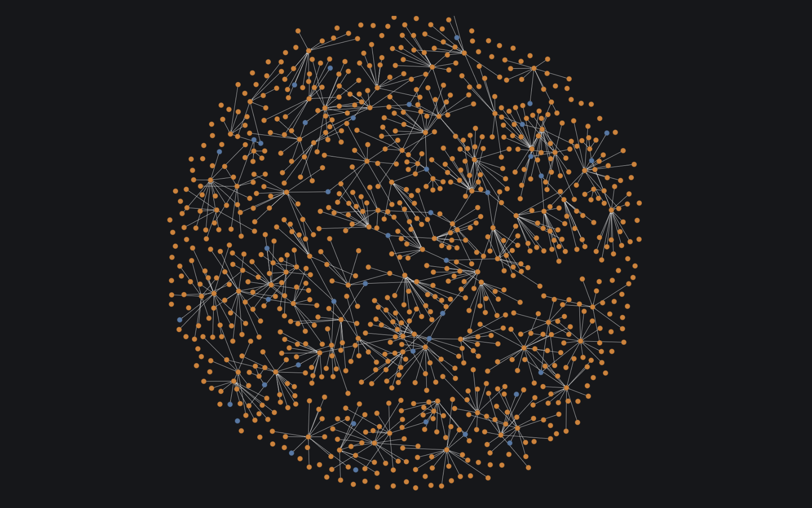
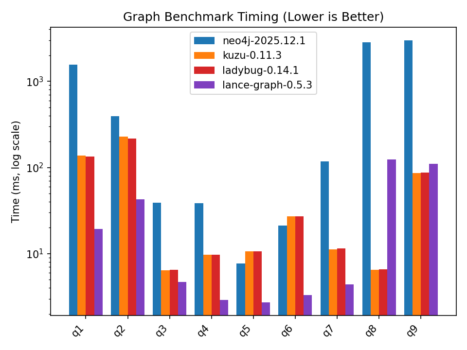

# Graph benchmarks

This repo was originally a benchmark for Kuzu described in this [blog post](https://thedataquarry.com/posts/embedded-db-2/). Since October 2025, Kuzu has been archived and is no longer maintained. Kuzu is now succeeded by a fork, [Ladybug](https://github.com/LadybugDB/ladybug), maintained by @adsharma.

The benchmarks below are updated to compare multi-hop retrieval performance across newer systems like Ladybug and [lance-graph](https://github.com/lance-format/lance-graph),
an open source graph engine built in Rust on top of the Lance format.

It does the following:

* Generate an artificial social network dataset, including persons, interests and locations
  * You can scale up the size of the artificial dataset using the scripts provided and test query performance on larger graphs
* Ingest the dataset into two graph databases: Kuzu and Neo4j (community edition)
* Run a set of queries that compare the query performance on a suite of queries that involve multi-hop traversals or top-k results with filters and aggregations

## Setup

We use [uv](https://docs.astral.sh/uv/getting-started/installation/) to manage the dependencies.

```sh
# Sync the dependencies locally
uv sync
```
All the dependencies are listed in `pyproject.toml`.

## Dataset

An artificial social network dataset is generated specifically for this exercise, via the [Faker](https://faker.readthedocs.io/en/master/) Python library.

### Graph schema

We'll create an artificial social network dataset of 100K person profiles, and their associated connections per the following schema.


The schema describes the following nodes and relationships, along with properties on each node:
* `Person` node `FOLLOWS` another `Person` node
* `Person` node `LIVES_IN` a `City` node
* `Person` node `HAS_INTEREST` towards an `Interest` node
* `City` node is `CITY_IN` a `State` node
* `State` node is `STATE_IN` a `Country` node

### Generate dataset

A shell script `generate_data.sh` is provided in the root directory of this repo that sequentially runs the Python scripts, generating the data for the nodes and edges for the social network. This is the recommended way to generate the data. A single positional argument is provided to the shell script: The number of person profiles to generate -- this is specified as an integer, as shown below.

```sh
# Generate data with 100K persons and ~2.4M edges
bash generate_data.sh 100000
```
This outputs:
```
Generating 100000 samples of data
Generate 50000 fake female profiles.
Generate 50000 fake male profiles.
Wrote 100000 person nodes to parquet
Obtained 7125 cities from countries: ['US', 'GB', 'CA']
Wrote 7117 cities to parquet
Wrote 273 states to parquet
Wrote 3 countries to parquet
Wrote 41 interests nodes to parquet
Generated 999987 edges in total without self-connections
Generated 500 super nodes for 100000 persons
Wrote 2417738 edges for 100000 persons
Generated residence cities for persons. Top 5 common cities are: Dallas, Portland, Kansas City, Manhattan, Sacramento
Wrote 250067 edges for 100000 persons
Wrote 7117 edges for 7117 cities
Wrote 273 edges for 273 states
```

We are now ready with the benchmark dataset in Parquet format!

> [!NOTE]
> Due to minor differences in RNG across systems, the exact dataset reproduced on your end may be different than the one used for this benchmark. So exact numbers in the query results may not align across runs when the dataset is regenerated, but the larger trends will remain the same, no matter where this is run.

## Ingest the data as a graph

Navigate to the individual directories to see the instructions on how to ingest the data into each graph system.

The generated dataset produces a rich and well-connected graph, a subgraph of which is visualized below. Certain groups of persons form a clique, and some others are central hubs with many connections, and each person can have many interests, but only one primary residence city.



## Run the queries

Some sample queries are run in each DB to verify that the data is ingested correctly, and that the results are consistent with one another.

The following questions are asked of both graphs:

* **Query 1**: Who are the top 3 most-followed persons?
* **Query 2**: In which city does the most-followed person live?
* **Query 3**: Which 5 cities in a particular country have the lowest average age in the network?
* **Query 4**: How many persons between ages 30-40 are there in each country?
* **Query 5**: How many men in London, United Kingdom have an interest in fine dining?
* **Query 6**: Which city has the maximum number of women that like Tennis?
* **Query 7**: Which U.S. state has the maximum number of persons between the age 23-30 who enjoy photography?
* **Query 8**: How many second-degree paths exist in the graph?
* **Query 9**: How many paths exist in the graph through persons age 50 to persons above age 25?

## High-level results

| Query | neo4j-2025.12.1 (ms) | kuzu-0.11.3 (ms) | ladybug-0.14.1 (ms) | lance-graph-0.5.1 (ms) |
| --- | --- | --- | --- | --- |
| q1 | 1552ms | 138ms (11.2x) | 135ms (11.5x) | 19ms (79.7x) |
| q2 | 395ms | 228ms (1.7x) | 215ms (1.8x) | 41ms (9.8x) |
| q3 | 39ms | 6ms (6.1x) | 6ms (6.0x) | 5ms (8.4x) |
| q4 | 38ms | 10ms (3.9x) | 10ms (3.9x) | 3ms (13.4x) |
| q5 | 8ms | 11ms (0.7x) | 11ms (0.7x) | 3ms (2.9x) |
| q6 | 21ms | 27ms (0.8x) | 27ms (0.8x) | 3ms (6.4x) |
| q7 | 117ms | 11ms (10.5x) | 11ms (10.2x) | 4ms (26.9x) |
| q8 | 2831ms | 7ms (435.3x) | 7ms (428.5x) | 130ms (21.8x) |
| q9 | 2987ms | 86ms (34.7x) | 88ms (34.1x) | 126ms (23.7x) |



> 🔥 The n-hop path-finding queries (8 and 9) in Kuzu/Ladybug benefit from hybrid joins (WCOJ + binary) and factorization, which are query processing innovations described in the [Kùzu research paper](https://www.cidrdb.org/cidr2023/papers/p48-jin.pdf).

## Explanation of results

See the [results](./results/) directory for an explanation of query results, and the script used to generate the plot.

### Ideas for future work

#### Scale up the dataset

You can attempt to generate a much larger artificial dataset of ~100M nodes and ~2.5B edges, and see how the performance compares across these different systems, if you're interested.

```sh
# Generate data with 100M persons and ~2.5B edges (WARNING: takes a long time in Python!)
bash generate_data.sh 100000000
```

Python is really slow to generate data of that scale. [Here's an example](https://github.com/thedataquarry/rustinpieces/tree/main/src/mock_data) of using Rust and the `fake-rs` crate to do this much faster.

#### Relationship property aggregation

The queries 1-9 in this benchmark are all on node properties. You can add relationship properties in the dataset
to see how the two DBs compare when aggregating on them. For example, add a `since` date property on the
`Follows` edges to run filter queries on how long a person has been following another person.
